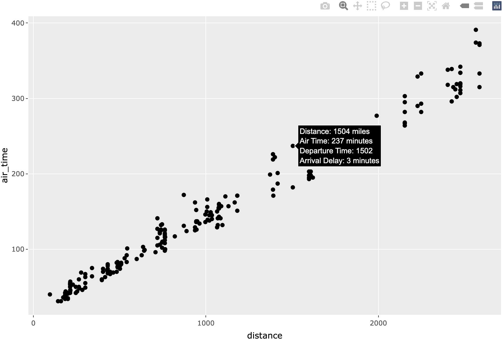

```{r setup, include=FALSE}
knitr::opts_chunk$set(echo = TRUE, cache = TRUE)
options(width = 55)
library(dslabs)
library(tidyverse)
library(reticulate)
```

## GitHub Page

These slides, source file, the code chunks, the workshop activities, and the data files can be found at [github.com/rbrown53/RRDS25](github.com/rbrown53/RRDS25). 


## `ggplot2 ` Introduction

While knowing how to plot using the base **R** packages is important, many **R** users are using the `ggplot2` package (which is part of the tidyverse) more and more for making better-looking plots.

**Advantages of ggplot2**

*   It's consistent! gg stands for "grammar of graphics"; easy base system for adding/removing plot elements, with room for being fancy too
*   Very flexible
*   Themes available to polish plot appearance
*   Active maintenance/development
*   Plots, or whole parts of plots, can be saved as objects
*   Easy to add complexity or revert to earlier plot

## `ggplot2 ` Introduction

**Disadvantages of ggplot2**

*   Sometimes more complicated than base **R** plotting
*   Difficult to work with in iterated functions
*   No 3-D graphics
*   ggplot is often slower than base graphics
*   The default colors can be difficult to change
*   You might need to change the structure of your data frame to make certain plots (use `tidyr::pivot_longer()`)

## `plotnine ` Introduction

The `plotnine` package in Python is "an implementation of a grammar of graphics in Python based on ggplot2." Installation instructions can be found at https://plotnine.org. A few notes about plotnine:

* It is developed by Hassan Kibirige and sponsored by Posit 
* It is still in development (currently version 0.14.5)
* Nearly all functions from `ggplot2` work exactly the same way, with only minor syntactic differences
  - Some more advanced functions to not work yet in `plotnine`

So, when learning `ggplot2`, you are also, in essence, learning `plotnine`. 

## `plotnine ` Differences

The main differences between `ggplot2` and `plotnine` are:

* Titles in `plotnine` are by default are centered instead of left-aligned
* We need to put quotes around variable names in `plotnine`. 
* Any function argument that has a period (.) in `ggplot2` has an underscore (_) in `plotnine`
  - Ex. `theme(axis.title)` in `ggplot2` would be `theme(axis_title)` in `plotnine`.
* We put parentheses around all functions to build a plot in `plotnine`.
* We need to save the plot as an object in `plotnine` and show it with `plot_name.show()`. 

In these slides, we will focus on `ggplot2`, but I'll show some examples in `plotnine` as well.

## `ggplot` Basics

There are three primary components to plotting with `ggplot2`:

*   The **data** component. This is what data set and variables we are actually plotting.
*   The **geometry** component. This describes what it is we are plotting. Examples include barplots, scatter plots, histograms, smooth densities, qqplots, boxplots, etc.
*   The **aesthetic mapping** or just the **mapping**. The two most important cues in this plot are the point positions on the x-axis and y-axis. Each point represents a different observation, and we map data about these observations to visual cues like x- and y-scale. Color is another visual cue that we map to region. How this is defined depends on what type of geometry we are using.

## Example dataset: NYC Flights

```{r install ggplot2, eval = FALSE}
install.packages("ggplot2")
install.packages("nycflights13")
```

\small
```{r load ggplot2}
library(ggplot2)
library(nycflights13)
head(flights, 3)
```

## Example in Base Plotting

There is essentially just one primary function to know: `ggplot()`. However, `ggplot()` needs lots of other support functions.

\small
```{R compare functions, out.width="44%"}
# load the flights dataset and take a sample of 200
flights <- na.omit(nycflights13::flights); set.seed(1)
flights <- flights[sample(1:nrow(flights), 200),]
plot(flights$distance, flights$air_time, 
     xlab = "Flight Distance (miles)", 
     ylab = "Time in Air (minutes)",
     main = "Base Plot: Flights")
```
\normalsize

## Example in `ggplot2`

In a ggplot, we need to begin with the `ggplot()` function and then add on (literally with a `+` sign) to that plot using other commands. In this case, I put `geom_point()` to add those solid dots.

```{r ggplot1a, echo=T, eval=F, out.width="47%"}
ggplot(data = flights) +
  geom_point(aes(x = distance, y = air_time)) + 
  labs(x = "Flight Distance (miles)", 
       y = "Time in Air (minutes)", 
       title = "ggplot: Flights")
```

## Example in `ggplot2`

```{r ggplot1b, echo=F, eval=T, out.width="93%"}
ggplot(data = flights) +
  geom_point(aes(x = distance, y = air_time)) + 
  labs(x = "Flight Distance (miles)", 
       y = "Time in Air (minutes)", 
       title = "ggplot: Flights")
```


## Example in `plotnine`

```{python plotnine1a, eval = F, echo = T, out.width="90%"}
import pandas as pd    # Needed to read in data file
from plotnine import * # Import all functions from plotnine
flights = pd.read_csv('flights.csv') # Read in data file

p = (
  ggplot(flights)
  + geom_point(aes(x = "distance", y = "air_time"))
  + labs(x = "Flight Distance (miles)",
         y = "Time in Air (minutes)", 
         title = "plotnine: Flights")
)
p.show()
```

## Example in `plotnine`

```{python plotnine1b, eval = T, echo = F, out.width="90%"}
import pandas as pd    # Needed to read in data file
from plotnine import * # Important all functions from plotnine
flights = pd.read_csv('~/My Drive/Red Rock Data Science Conference/2025/Data Visualization Workshop/Slides/flights.csv')

p = (
  ggplot(flights)
  + geom_point(aes(x = "distance", y = "air_time"))
  + labs(x = "Flight Distance (miles)", 
         y = "Time in Air (minutes)", 
         title = "plotnine: Flights")
)
p.show()
```

## Example in `ggplot2` with Labels

Here is an example adding text to the plot.

\small
```{r ggplot_text, echo=T, eval=T, out.width="58%"}
ggplot(data = flights) +
  geom_point(aes(x = distance, y = air_time)) + 
  geom_text(aes(x = distance, y = air_time, label = arr_delay)) +
  labs(x = "Flight Distance (miles)", y = "Time in Air (minutes)", 
       title = "ggplot: Flights with Text")
```


## Global vs Local Aesthetic Mapping

Instead of putting the `aes()` function in the `geom_*()` function, we can put it in the `ggplot()` and it will apply everywhere.

Anything put into the `ggplot()` function will apply globally to the entire plot (unless it is overwritten) whereas anything put into the geometry will only apply to that geometry. Some options, like size, can only be put into the geometry.

## Example in `ggplot2` with Gobal `aes()`

Now the `x` and `y` aesthetics are only given once. The `nudge_x` option will move the text to the right 45 units.

```{r ggplot_text_red, echo=T, eval=T, out.width="55%"}
ggplot(data = flights, aes(x = distance, y = air_time)) +
  geom_point() + 
  geom_text(aes(label = arr_delay), nudge_x = 45) +
  labs(x = "Flight Distance", y = "Air Time")
```

## Example in `ggplot2` with Color

This will make the points red, but the text blue.

```{r ggplot_red_blue, echo=T, eval=T, out.width="60%"}
ggplot(data = flights, aes(x = distance, y = air_time)) +
  geom_point(color = "red") + 
  geom_text(aes(label=arr_delay), nudge_x=45, color="blue") +
  labs(x = "Flight Distance", y = "Air Time")
```

## Piping in `ggplot2`

Pipes work very well with `ggplot` also. Remember that pipes (`|>` or `%>%`) by default put objects being piped into the first argument of the function.


```{r ggplot_pipe2, echo=T, eval=T, out.width="55%"}
flights |> 
  ggplot(aes(distance, air_time)) + 
  geom_point(col = "brown") + 
  labs(x = "Flight Distance", y = "Air Time")
```

## Adding Loess Curve

Adding `geom_smooth()` will, by default, add a loess curve to the data and put confidence interval bands on the curve. 
\small
```{r ggplot_loess, echo=T, eval=T, out.width="50%"}
ggplot(flights, aes(distance, air_time)) + 
  geom_point() + 
  geom_smooth(color = "red", linetype = "dashed") +
  labs(x = "Flight Distance", y = "Air Time")
```

## Adding Least Squares Line

Putting `method = "lm"` in the `geom_smooth()` function will add the line of best fit.

```{r ggplot_lm, echo=T, eval=T, out.width="55%"}
ggplot(flights, aes(distance, air_time)) + 
  geom_point() + 
  geom_smooth(method = "lm", se = F, formula = "y ~ x") +
  labs(x = "Flight Distance", y = "Air Time")
```


## Example in `ggplot2` with Theme

We can change the background using `theme_*()`. There are `theme_bw()`, `theme_dark()`, `theme_classic()`, `theme_minimal()` and more.

```{r ggplot_theme, echo=T, eval=T, out.width="55%"}
ggplot(data = flights, aes(x = distance, y = air_time)) +
  geom_point() +
  labs(x = "Flight Distance", y = "Air Time") + 
  theme_bw()
```

## Changing the Graph Options in `ggplot2`

We can change the type of points added in the `geom_point()` function.

```{r ggplot_shape, echo=T, eval=T, out.width="55%"}
ggplot(data = flights, aes(x = distance, y = air_time)) +
  geom_point(size = 5, color = "red", shape = 2) + 
  labs(title = "Red, triangular ggplot")
```

The `shape` argument works just like `pch` in base plotting.


## Changing Font Size and Type

We can change font size and type in the `theme()` function. Note that if both `theme()` and a function like `theme_bw()` are used, the `theme_bw()` function must be put first or else it will overwrite the `theme()` function.


```{r ggplot_font_a, out.width="48%", echo = T, eval = F}
# change font size and style
ggplot(data = flights, aes(x = distance, y = air_time)) +
  geom_point(shape = 16, size = 3) +
  labs(title = "Check out this Font!",
       x = "Flight Distance (miles)",
       y = "Air Time (minutes)") + 
  theme(axis.title = element_text(size = 20),
        axis.text = element_text(size = 14),
        plot.title = element_text(size = 30, face = "bold"))
```

## Changing Font Size and Type

```{r ggplot_font_b, out.width="95%", echo = F, eval = T}
# color by a continuous variable
ggplot(data = flights, aes(x = distance, y = air_time)) +
  geom_point(shape = 16, size = 3) +
  labs(title = "Check out this Font!",
       x = "Flight Distance (miles)", y = "Air Time (minutes)") + 
  theme(axis.title = element_text(size = 20),
        axis.text = element_text(size = 14),
        plot.title = element_text(size = 30, face = "bold"))
```


## `ggplot2` Line Graph

Instead of adding `geom_point()`, we can add something else, like `geom_line()`

```{r ggplot_line, echo=T, eval=T, out.width="65%"}
ggplot(data = flights, aes(x = distance, y = air_time)) +
  geom_line() + labs(title = "Line ggplot")
```

## `ggplot2` Area Graph

Or even something like shading the area under the points.

```{r ggplot_area, echo=T, eval=T, out.width="60%"}
ggplot(data = flights, aes(x = distance, y = air_time)) +
  geom_area() + labs(title = "Area ggplot")
```

Not sure this is a good idea for this plot. 

## Grouping by Another Variable

ggplot makes it easy to split the data using another variable. Simply put the `color` argument in the `aes()` function in `ggplot`. This will automatically add a legend. We can change other aspects of the plot, like the shape, based on another variable too.

```{r ggplot_group1, echo=T, eval=T, out.width="49%"}
ggplot(data = flights, aes(x = distance, y = air_time, 
                           color=origin, shape=origin)) +
  geom_point(size = 3)
```

## Grouping by Another Variable - Adding Lines

Adding `geom_smooth()` when the graph is grouped by another variable will add a line for each group.

```{r ggplot_group1_lines, echo=T, eval=T, out.width="55%"}
ggplot(data = flights, aes(x = distance, y = air_time,
                           color=origin, shape=origin)) +
  geom_point(size = 3) +
  geom_smooth(method = "lm", formula = "y ~ x", se = F)
```

## Grouping by Another Variable - One Line

If we wanted only one line of best fit while still changing the color and/or shape by origin, then we would have to be careful about where we add those aesthetics. 
\small
```{r ggplot_group1_1line, echo=T, eval=T, out.width="58%"}
ggplot(data = flights, aes(x = distance, y = air_time)) +
  geom_point(aes(color = origin, shape = origin), size = 3) +
  geom_smooth(method = "lm", formula = "y ~ x", color = "black")
```

## Grouping by Another Variable - Front/Back

In that last plot, the line was in front of the points. We can put it behind the points by putting the `geom_smooth()` function first. The order of the geometries matters. 
\small
```{r ggplot_group1_line_behind, echo=T, eval=T, out.width="58%"}
ggplot(data = flights, aes(x = distance, y = air_time)) +
  geom_smooth(method = "lm", formula = "y ~ x", color = "black") +
  geom_point(aes(color = origin, shape = origin), size = 3) 
```


## Change Colors Manually

We can manually change the colors using the `values` option in the `scale_color_manual()` add on function.

\small
```{r ggplot_group2, echo=T, eval=T, out.width="58%"}
ggplot(data = flights, aes(x = distance, y = air_time, 
                           color=origin, shape=origin)) +
  geom_point(size = 3) +
  scale_color_manual(values=c("orange","darkgreen","lightblue"))
```


## Change Order of Grouped Variable Categories

We can manually change the order of the categories in the legend using the `breaks` option in the `scale_color_manual()` add on function. It is similar for the shape with `scale_shape_manual()`. 

```{r ggplot_group3a, echo=T, eval=F, out.width="45%"}
ggplot(data = flights, aes(x = distance, y = air_time, 
                           color=origin, shape=origin)) +
  geom_point(size = 3) + 
  scale_color_manual(
    breaks = c("JFK", "LGA", "EWR"),
    values = c("darkgreen", "lightblue", "orange")
    ) +
  scale_shape_manual(
    breaks = c("JFK", "LGA", "EWR"),
    values = c("J", "L", "N")
    ) +
  theme_bw()
```

## Example

```{r ggplot_group3b, echo=F, eval=T, out.width="95%"}
ggplot(data = flights, 
       aes(x = distance, y = air_time, color = origin, shape = origin)) +
  geom_point(size = 3) + 
  scale_color_manual(
    breaks = c("JFK", "LGA", "EWR"),
    values = c("darkgreen", "lightblue", "orange")
    ) +
  scale_shape_manual(
    breaks = c("JFK", "LGA", "EWR"),
    values = c("J", "L", "N")
    ) +
  theme_bw()
```


## Grouping by a Continuous Variable

We can also group by a continuous variable. In this case, we can change the color based on the departure time variable.

```{r ggplot_group4a, out.width="45%", eval = F}
# color by a continuous variable
ggplot(data = flights, 
       aes(x = distance, y = air_time, color = dep_time)) +
  geom_point() +
  scale_colour_continuous(type = "viridis")
```

## Grouping by a Continuous Variable Example

```{r ggplot_group4b, out.width="95%", echo = F}
# color by a continuous variable
ggplot(data = flights, 
       aes(x = distance, y = air_time, color = dep_time)) +
  geom_point() +
  scale_colour_continuous(type = "viridis")
```


## Changing Axis Limits

We can change the limits of the x and y axes if we don't adjust the axis ticks using the `lims()` function.

```{r ggplot_limits, out.width="55%", echo = T, eval = T}
# color by a continuous variable
ggplot(data = flights, aes(x = distance, y = air_time)) +
  geom_point(size = 3) +
  lims(x = c(0, 4000), y = c(0, 400))
```

## Changing Axis Ticks

If we want to change the axis ticks, we can use the `scale_x_continous()` and `scale_y_continuous()` functions. If these functions are used, then the x and y limits can only be changed in those functions, not in `lims()`. If both a `scale_*()` function and the `lims()` function are used, then one will override the other. 

```{r ggplot_ticks_a, out.width="56%", echo = T, eval = F}
# color by a continuous variable
ggplot(data = flights, aes(x = distance, y = air_time)) +
  geom_point(size = 3) +
  scale_x_continuous(breaks = seq(0, 4000, by = 500), 
                     limits = c(0, 4000)) +
  scale_y_continuous(breaks = seq(0, 400, by = 50), 
                     limits = c(0, 500))
```

## Changing Axis Ticks

```{r ggplot_ticks_b, out.width="95%", echo = F, eval = T}
# color by a continuous variable
ggplot(data = flights, aes(x = distance, y = air_time)) +
  geom_point(size = 3) +
  scale_x_continuous(breaks = seq(0, 4000, by = 500), 
                     limits = c(0, 4000)) +
  scale_y_continuous(breaks = seq(0, 400, by = 50), 
                     limits = c(0, 500))
```


## `ggplot2` for a Single Quantitative Variable: Histogram

Of course, we can also use `ggplot()` for plotting a single variable. We can make histograms, boxplots, barplots, etc.

```{r ggplot_hist1, echo=T, eval=T, out.width="55%"}
# Save the base plot as an object p. Then add to p.
p <- ggplot(data = flights, aes(x = arr_delay))
p + geom_histogram(color = "black", fill = "lightblue",
                   bins = 20)
```

## `ggplot2` for a Single Quantitative Variable: Histogram

```{r ggplot_hist2, echo=T, eval=T, out.width="58%"}
# We already created p, so we can add other options to it.
# Smaller alpha makes the plot more transparent.
p + geom_histogram(color = "darkgreen", fill = "green",
                   bins = 50, alpha = 0.1, 
                   linetype = 2, linewidth = 1) +
  labs(x = "Arrival Delay (minutes)", y = "Frequency")
```

## `ggplot2` for a Single Quant. Variable: Density Plot

`geom_density` can be used to compare density plots for several groups.

```{r ggplot_density, out.width="71%"}
ggplot(data = flights, aes(x = arr_delay, fill = origin)) +
  geom_density(alpha = 0.3)
```

## `ggplot2` for a Single Quantitative Variable: Boxplot

Creating a basic boxplot. We can also make it vertical by putting\
`y = arr_delay` in the `aes()` function instead of `x = arr_delay`.

```{r ggplot_box1, echo=T, eval=T, out.width="65%"}
ggplot(data = flights, aes(x = arr_delay)) +
  geom_boxplot(color = "black", fill = "lightblue")
```

## `ggplot2` for a Single Quant. Variable: Side-by-Side Boxplots

We can make side-by-side boxplots grouped by a categorical variable as `x` (or as `y` if you want side-by-side horizontal boxplots).

```{r ggplot_box2, echo=T, eval=T, out.width="58%"}
ggplot(data = flights, aes(x = origin, y = arr_delay)) +
  geom_boxplot(color = "black", fill = "lightblue")
```

## `ggplot2` for a Single Categorical Variable: Barplot

We can make plots for categorical variables as well. The `fct_infreq()` function arranges the bars from highest to lowest.

```{r ggplot_bar1a, echo=T, eval=T, out.width="60%"}
ggplot(data = flights, aes(x = fct_infreq(carrier))) +
  geom_bar(color = "black", fill = "lightblue") +
  labs(x = "Airline", y = "Frequency")
```

## `ggplot2` for a Single Categorical Variable: Barplot

These labels are short, but if they were longer, it would be nice to angle them. You can do that in the `theme()` function.

```{r ggplot_bar1b, echo=T, eval=T, out.width="54%"}
ggplot(data = flights, aes(x = fct_infreq(carrier))) +
  geom_bar(color = "black", fill = "lightblue") +
  labs(x = "Airline", y = "Frequency") +
  theme(axis.text.x = element_text(angle = 45, hjust = 1))
```

## `ggplot2` for a Single Categ. Variable: Side-by-Side Barplots

We can split the bars by another variable. In this case, we will make a plot of the airline carrier and break it up by flight origin airport and put the bars side by side.
\small
```{r ggplot_bar2, echo=T, eval=T, out.width="58%"}
ggplot(data = flights, aes(x = carrier, fill = origin)) +
  geom_bar(color = "black", position = "dodge") +
  labs(x = "Airline", y = "Frequency", fill = "Airport Origin")
```

## `ggplot2` for Two Categ. Variables: Side-by-Side Barplots

We can change the fill colors using `scale_fill_manual()`.
\small
```{r ggplot_bar3, echo=T, eval=T, out.width="58%"}
ggplot(data = flights, aes(x = carrier, fill = origin)) +
  geom_bar(color = "black", position = "dodge") +
  labs(x = "Airline", y = "Frequency",
       fill = "Airport Origin") + 
  scale_fill_manual(values=c("orange", "darkgreen", "lightblue"))
```

## `ggplot2` for Two Categorical Variables: Stacked Barplot

We can split the bars by another variable. In this case, we will make a plot of carrier, break it up by origin, and stack the bars.

```{r ggplot_bar4, echo=T, eval=T, out.width="55%"}
ggplot(data = flights, aes(x = carrier, fill = origin)) +
  geom_bar(color = "black", position = "stack") +
  labs(x = "Airline", y = "Frequency",
       fill = "Airport Origin")
```

## `ggplot2` for Two Categorical Variables: Stacked Barplot

We can split the bars by another variable. In this case, we will make a plot of carrier, break it up by origin, stack the bars, and adjust them so each bar totals 100%.

```{r ggplot_bar5, echo=T, eval=T, out.width="48%"}
ggplot(data = flights, aes(x = carrier, fill = origin)) +
  geom_bar(color = "black", position = "fill") +
  labs(x = "Airline", y = "Proportion",
       fill = "Airport Origin")
```

## `ggplot2` Barplot Identity

We often want to use a column of a data frame or tibble as the heights of our bar plot instead of having ggplot tabulate them for us. For this, we need to put `stat = "identity"` in the `geom_bar()` function.

\footnotesize
```{r ggplot_bar6, echo=T, eval=T, out.width="45%"}
flights |> group_by(origin) |>
  summarize(avg_delay = mean(arr_delay)) |>
  ggplot(aes(x = origin, y = avg_delay, fill = origin)) +
  geom_bar(color = "black", stat = "identity") +
  labs(x = "Airport Origin", y = "Average Arrival Delay (minutes)") +
  theme(legend.position = "none")
```

## `ggplot2` `geom_col()`

The exact same thing can be accomplished using `geom_col()`. `geom_col()` is equivalent to `geom_bar(stat = "identity")`.
t used functions to add
\footnotesize
```{r ggplot_col, echo=T, eval=T, out.width="45%"}
flights |> group_by(origin) |>
  summarize(avg_delay = mean(arr_delay)) |>
  ggplot(aes(x = origin, y = avg_delay, fill = origin)) +
  geom_col(color = "black") +
  labs(x = "Airport Origin", y = "Average Arrival Delay (minutes)") +
  theme(legend.position = "none")
```


## More Complex Plots: Facet Grid

Use facet_grid() or facet_wrap() to create a separate plot for each value of a factor variable. We don't have to change any of the original plotting code, just add the facet command to it. Faceting can also be done on more than one categorical variable to create a grid of plots.

Additionally, it is sometimes helpful to save a simpler version of a plot, and then add onto it later with additional layers (for example, an if/else statement that plots different layers dependent on if a criterion is met or not).

We might want to summarize the data in the previous plot with a smoother on top of the points. With ggplot, we can simply add the `geom_smooth()` command. Each `geom_*()` just adds another layer to the plot.

## More Complex Plots: Facet Grid

\small
```{r ggplot_facet1,fig.height = 2, fig.width = 6}
# make the basis for a plot using ggplot save it as p
p <- ggplot(data = flights, aes(x = distance, y = air_time))
# add a geom (points) and display the plot
p + geom_point(size = 0.5) + facet_grid(cols = vars(origin),
     labeller = label_both) + labs(x = "Distance", y = "Air Time",
       title = "Air time versus distance, separated by origin")
```

## More Complex Plots: Facet Grid

```{r ggplot_facet2,out.width="50%", echo=T, eval=F}
# make the basis for a plot using ggplot save it as p
p <- flights |>
  filter(carrier %in% c("UA", "DL", "AA")) |>
  ggplot(aes(x = distance, y = air_time))
# add a geom (points) and display the plot
p + geom_point() + geom_jitter(width = 100) +
  facet_grid(cols = vars(origin), rows = vars(carrier),
     labeller = label_both) + 
  labs(x = "Distance", y = "Air Time",
       title = paste("Air time versus",
                     "distance by origin and carrier"))
```

## More Complex Plots: Facet Grid

```{r ggplot_facet3,out.width="95%", echo=F, eval=T}
# make the basis for a plot using ggplot save it as p
p <- flights |>
  filter(carrier %in% c("UA", "DL", "AA")) |>
  ggplot(aes(x = distance, y = air_time))
# add a geom (points) and display the plot
p + geom_point() + geom_jitter(width = 100) +
  facet_grid(cols = vars(origin), rows = vars(carrier),
     labeller = label_both) + 
  labs(x = "Distance", y = "Air Time",
       title = paste("Air time versus",
                     "distance by origin and carrier"))
```


## Example in `plotnine`

\scriptsize
```{python final_plotnine_code, eval = F, echo = T}
import pandas as pd    # Needed to read in data file
import plotnine as p9
from plotnine import * # Import all functions from plotnine
p9.options.figure_size = (12, 7)
flights = pd.read_csv('flights.csv')

p = (
  ggplot(flights, aes(x = "distance", y = "air_time", 
                      color = "origin", shape = "origin"))
  + geom_point(size = 0.5) 
  + geom_jitter(width = 100)
  + theme_bw()
  + labs(x="Distance", y = "Air Time", title = "ggplot",
         color = "Origin Airport", shape = "Origin Airport")
  + scale_x_continuous(breaks = list(range(0, 3000, 500)))
  + scale_color_manual(values = ["orange", "darkgreen", "lightblue"])
  + theme(axis_title = element_text(size = 20), # note _ instead of .
          plot_title = element_text(size = 24),
          axis_text_x = element_text(angle = 60, vjust = 1)) 
  + facet_grid(rows = "origin", cols = "carrier", labeller = "label_both")
)
p.show()
```


## Example in `plotnine`

\small
```{python final_plotnine_image, eval = T, echo = F}
import pandas as pd    # Needed to read in data file
import plotnine as p9
from plotnine import * # Import all functions from plotnine
p9.options.figure_size = (12.5, 8.5)
flights = pd.read_csv('~/My Drive/Red Rock Data Science Conference/2025/Data Visualization Workshop/Slides/flights.csv')

p = (
  ggplot(flights, aes(x = "distance", y = "air_time", 
                      color = "origin", shape = "origin"))
  + geom_point(size = 0.5) 
  + geom_jitter(width = 100)
  + theme_bw()
  + labs(x="Distance", y = "Air Time", title = "plotnine Plot",
         color = "Origin Airport", shape = "Origin Airport")
  + scale_x_continuous(breaks = list(range(0, 3000, 500)))
  + scale_color_manual(values = ["orange", "darkgreen", "lightblue"])
  + theme(axis_title = element_text(size = 20), # note _ instead of .
          plot_title = element_text(size = 24),
          axis_text_x = element_text(angle = 60, vjust = 1)) 
  + facet_grid(rows = "origin", cols = "carrier", labeller = "label_both")
)
p.show()
```


## Summary

The syntax of a ggplot is `ggplot(data, aes(x, y))` and you add on to the plot with `+` at the end of each line.

The most used functions to add onto a ggplot are:

* `geom_point()`, `geom_line()`, `geom_histogram()`, `geom_boxplot()`, `geom_text()`, `geom_bar()`, etc.
* `labs()` for labels including a plot title.
* `lims()` for axis limits.
* `theme()` for text size and visually changing other things.
* `scale_color_manual()` or `scale_fill_manual()` for changing the color or fill of the plot manually. 
* `scale_x_continuous()` or `scale_y_continuous()` for changing the axis ticks and limits.


## Further Resources & Assistance

-   Cheat sheet for data visualization with ggplot2 (accessible in Rstudio by going to Help -\> Cheat Sheets -\> Data visualization with ggplot2)
-   ggplot2 documentation
-   Google
-   Stack overflow
-   Hadley Wickham's book: <https://ggplot2-book.org/>
-   Rafael Irizarry's book: <http://rafalab.dfci.harvard.edu/dsbook-part-1/dataviz/ggplot2.html>.
- AI tools like ChatGPT

## Bonus: `plotly` 

The `plotly` **R** package plays very nicely with `ggplot` objects. You can use the `ggplotly()` function on a ggplot to make it interactive.

\small
```{r plotly, message=FALSE, eval = F, echo = T}
library(plotly) 
p <- flights |>
  mutate(hover_label = paste(
    "Distance:", distance, "miles",
    "\nAir Time:", air_time, "minutes",
    "\nDeparture Time:", dep_time,
    "\nArrival Delay:", arr_delay, "minutes"
    )
  ) |>
  ggplot(aes(x = distance, y = air_time, text = hover_label)) +
  geom_point()
ggplotly(p, tooltip = "text") # Makes only text shown in hover, 
                              #   not x or y
```

## Bonus: `plotly` 

{width=90%}


## Session info
\tiny
```{r pressure, warning = FALSE, cache = F}
sessionInfo()
```

